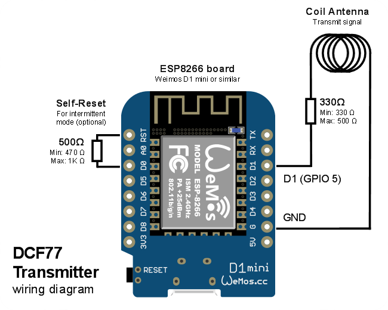

# 

This program allows syncing clocks using the DCF77 protocol in places where DCF77 is not available. [DCF77](https://en.wikipedia.org/wiki/DCF77) is a German longwave time signal and standard-frequency radio station running in Europe at 77.5 kHz.


## Assembling the project

### Material needed

The following material is needed for this project:

* An ESP8266-based board such as Weimos D1 Mini
* 0.3mm magnet wire for antenna _(diameter 0.25-0.5mm, length: 1-6m)_
* 330 Ohm resistor for antenna _(recommended range: 330-500 Ohm)_
* 500 Ohm resistor for self-reset _(recommended range: 470-1K Ohm)_ [optional]
* [D1 Mini 3D printed case and antenna support](https://www.thingiverse.com/thing:6726182) [optional]

### Wiring diagram

Wire components as shown in the diagram below:



> 📝 The resistor on coil antenna serves as current limiter to avoid damaging the ESP8266. GPIOs can provide a maximum current of ~12mA per pin (source: [GPIO Maximum current Imax](https://bbs.espressif.com/viewtopic.php?t=139)), so R=330Ω caps the current to 3.3V/330Ω = 10mA.

### Making the antenna

Make a coil with some wire. Start with a coil of ~10cm diameter with ~10 loops to generate a short-distance electromagnetic field (~10cm), then adjust to your needs.


A small antenna works very well if placed right behind your clock or a few centimeters away. A larger antenna (diameter ~20cm, ~6m of wire) allows transmitting up to ~1m away.

> **⚠ DISCLAIMER:** Sending a stronger signal to cover a larger area is likely forbidden by your local laws. Do not use an actual antenna or send amplified signal without knowing what you are doing.

## Firmware configuration

### Wi-Fi settings

Using [Arduino IDE](https://www.arduino.cc/en/software), open `dcf77-transmitter.ino`, uncomment and set Wi-Fi credentials:

```C
// Wi-Fi configuration
//const char* wifi_ssid   = "MyWiFiNetwork";
//const char* wifi_pass   = "S3cr3tWiFiP4ssw0rd";
```

Then select your board and flash the program.

> 📝 DCF77 signaling is slow. Each time code takes a whole minute to transmit. Clocks should need at least 1-3 minutes to properly synchronize to the signal once the board is running. Restarting the clock should cause it to sync immediately.

### NTP and time zone

Use the following settings to select NTP server and time zone:

```C
// NTP configuration
const char* ntp_server = "pool.ntp.org";
const char* time_zone = "CET-1CEST-2,M3.5.0/02:00:00,M10.5.0/03:00:00";
const int ntp_sync_interval_hours = 3;
```

* `ntp_server`: IP or hostname of NTP server. Default: [NTP Pool](https://www.ntppool.org/). See [Use](https://www.ntppool.org/use.html) and [ToS](https://www.ntppool.org/tos.html).
* `time_zone`: By default, DCF77-Transmitter transmits [CET](https://en.wikipedia.org/wiki/Central_European_Time) time like the actual DCF77 radio station. You can pick a different time zone string from [TIMEZONES.md](TIMEZONES.md).
* `ntp_sync_interval_hours`: How many hours between NTP syncs over Wi-Fi. Transmitter temporarily stops when syncing over Wi-Fi. ESP's internal clock is quite imprecise so keep the value low. Recommended range is 1-3.

> 📝 By default, DCF77-Transmitter syncs every 3 hours and uses boot minute, second, millisecond to derive next sync time, which is compliant with  NTP Pool [ToS](https://www.ntppool.org/tos.html). Reducing the interval to 1 hour is still compliant with the ToS and can help if your ESP's internal clock derives too much between syncs.

### GPIO and status LED

If needed, the following configuration options are available:

```C
// GPIO Pin configuration
const unsigned pwm_pin = 5;
const unsigned led_pin = LED_BUILTIN;
const bool led_enabled = true;
```

* `pwm_pin`: Antenna pin GPIO. Default: GPIO5 (1)
* `led_pin`: LED pin GPIO number or use LED_BUILTIN (1)
* led_enabled`: Enable or disable status LED. If enabled, the LED flashes in transmitting mode, and stays on when syncing with NTP over Wi-Fi.

1. See [ESP8266 Pinout Reference](https://randomnerdtutorials.com/esp8266-pinout-reference-gpios/) or backed up [D1 Mini pinout diagram](images/d1-mini-pinout.png).

## Intermittent mode

### ⚠ Requires fine tuning ⚠

By default, DCF77-Transmitter transmits continuously, except during sync with NTP server. This is the recommended mode since it's easy to set up.

For saving energy when running on battery, you can have DCF77-Transmitter run a few minutes per hour, then sleep for the rest of the hour using ESP's deep sleep timer. A D1 Mini should consume ~50mA during transmission and less than 1mA during deep sleep (5V power supply).

However, switching to intermittent mode comes with several caveats:

1.  Need to wire GPIO16 (D0) to RST for waking up from deep sleep, preferably using a resistor between 470-1K Ohm to avoid [issues flashing the ESP](https://www.esp8266.com/viewtopic.php?t=13101). Otherwise, your ESP will never wake from deep sleep.

2. The chosen activity period must match the time span where your clock actually tries to synchronize with the time signal, or syncing will not work. Clocks with screens usually have a sync indicator, but other do not, requiring trial and error to find a working time range.

3. ESP's deep sleep mode cause severe drift in its internal clock, so the ESP *will* wake a few minutes too soon or too late due to clock drift. DCF77-Transmitter allows configuring a correction factor to mitigate this.

4. Upon waking up, the ESP will need to resync its internal clock to have usable time value, which means the ESP needs to sync every hour at the exact same time. This is against [NTP Pool ToS](https://www.ntppool.org/tos.html), so you'll need to switch to a NTP service that allows that, or set-up your own NTP server. A positive aspect is that NTP synchronization takes place just before clock synchronization, so the transmitted time is more accurate.

The rest of this section consists in a tutorial to set up intermittent mode.

### Enable intermittent mode

First, make sure to wire the `WAKE` pin to the `RST` pin of your ESP8266 using a resistor as described in the wiring diagram above. On D1 Mini, the `WAKE` pin is `D0`. See [ESP8266 Pinout Reference](https://randomnerdtutorials.com/esp8266-pinout-reference-gpios/) or backed up [D1 Mini pinout diagram](images/d1-mini-pinout.png).

Then, enable intermittent mode:

```C
// Intermittent mode configuration
const bool intermittent_mode = true;
```

### Debug your setup using serial

Use `Tools` > `Serial Monitor` in Arduino IDE to show status messages and understand what is going on your transmitter. DCF77-Transmitter serial baud rate is `115200`.

### Install your own NTP server

Installing a NTP server is easy if you already have a Linux system running on your LAN such as a Raspberry Pi, so set it up if you can.

Alternatively, if you prefer not to set up your own NTP server, you should at least switch to a NTP service that allows syncing every hour at the same time. Ntppool.org does not allow this, but you can use [Google NTP](https://developers.google.com/time/guides), [CloudFlare NTP](https://www.cloudflare.com/time/) and many more.

Here are some instructions for installing a NTP server on Raspberry Pi OS (Raspbian):

* Install NTP: `sudo apt install ntp`
* Remove throttling in config, or your NTP client may get rate limited during testing:
  * Open `/etc/ntp.conf`
  * Remove [`limited`](https://docs.netgate.com/tnsr/en/latest/ntp/restrictions.html) keyword from the `restrict` directive, save and close
  * Restart the NTP service to reload its config: `service ntp restart`

Then note the IP address of your server and set it as NTP server:

```C
// NTP configuration
const char* ntp_server = "192.168.XX.XX";
```

> 📝 Your server IP should be addressed statically, or set manually in your router's DHCP server, to ensure that it will not change later.

Flash the firmware and check in serial monitor that your ESP is syncing as expected with your new NTP server.

### Adjusting clock drift correction

As per [RTC Time Module](https://nodemcu.readthedocs.io/en/dev/modules/rtctime/), the ESP8266 does not have an actual internal clock, it uses a counter during deep sleep that is affected by room & module temperatures:

> While it does keep a counter ticking while the module is sleeping, the accuracy with which it does so is highly dependent on the temperature of the chip. Said temperature changes significantly between when the chip is running and when it is sleeping, meaning that any calibration performed while the chip is active becomes useless mere moments after the chip has gone to sleep. As such, calibration values need to be deduced across sleep cycles in order to enable accurate time keeping.

By defaut, DCF77-Transmitter wakes at 55' every hour, and transmits for 10 minutes. You should run the module for a few hours, and note the average sleep and wakeup times, then deduce the correction factor that will work for your ESP8266 and room temperature:

```
correction_factor = (desired_wakeup_time - actual_wakeup_time) / (actual_wakeup_time - sleep_start_time)
```

> 🔍 Example: Sleeping at 12:05:00, trying to wake up at 12:54:30 but waking up at ~12:48:45. Correction = (54.5 - 48.75) / (48.75 - 5.00), which gives 0.17.

> 📝 When booting the ESP, it will start transmitting immediately, then deep sleep until desired wakeup time. Skip the first two hours of serial logs when determining the average sleep/wakeup times for computing your own correction factor.

Set the correction factor and reflash the firmware:

```C
const float sleep_clock_correction = 0.17f;
```

Let the module run for a few more hours, adjust the correction factor if needed (add/remove 0.01 values), then move to the next step once satisfied with the result.

### Configuring transmission times

The last step is configuring appropriate transmission times for your clock:

```
const int tx_minute_start = 55;
const int tx_duration_minutes = 10;
```

* `tx_minute_start`: Start transmission on the specified minute
* `tx_duration_minutes`: Duration of transmission in minutes

If unsure, a conservative value of start=50 and duration=20 should work well. You can try reducing the transmission time span to find minimal working values.

> 🔍 Most clocks will try to sync between 50' and 10'. I could observe that my clock starts syncing at '58 and stops at '59, but sync may sometime take longer, finishing at most at 04', hence the default values above.

> 📝 Despite configuring an accurate `correction_factor`, the ESP *will* wake up too soon or too late depending on room temperature, so just to be safe, it's better to set `tx_minute_start` ~2min sooner than needed and `tx_duration_minutes` ~4min longer than needed.

At this point, you should have intermittent mode fully functional. Congrats! 🎉

## Credits

Special thanks to Luigi Calligaris from [DCFake77](https://github.com/luigicalligaris/dcfake77/) for figuring out a way to work around ESP8266's PWM frequency limitation and generating the required 77.5 kHz signal:

> Due to limitations in the ESP8266 SDK, generating a 77.5 kHz PWM signal is not natively supported and would require re-writing a number of drivers. To make things simpler for this implementation the PWM is run at 25.833 kHz, which results in a third harmonic signal at 77.5 kHz.

Additionally, DCF77-Transmitter was made by studying the following resources:

* [DCF77 at Wikipedia](https://en.wikipedia.org/wiki/DCF77#Time_code_interpretation)
* [Official DCF77 documentation](https://www.ptb.de/cms/en/ptb/fachabteilungen/abt4/fb-44/ag-442/dissemination-of-legal-time/dcf77/dcf77-time-code.html)
* [DCFake77 for ESP8266](https://github.com/luigicalligaris/dcfake77/blob/master/dcfake77-esp8266/dcf77protocol.c)
* [DCF77 Transmitter for ESP32](https://github.com/SensorsIot/DCF77-Transmitter-for-ESP32/blob/master/DFC77_ESP32/DFC77_ESP32.ino)

Long story short: `DCF77-Transmitter-for-ESP32` is fully functional but requires an ESP32, which is more expensive. `DCFake77` works on ESP8266 but has inaccuracies in the protocol implementation and lacks advanced features. This project reuses some code from `DCFake77`, ideas from `DCF77-Transmitter-for-ESP32` and improves protocol implementation using the official documentation.

The [DCF77-Transmitter logo](images/dcf77-transmitter-logo.svg) was made specifically for this project using [Inkscape](https://inkscape.org/).

## License

DCF77-Transmitter is provided under [GPL v3.0](LICENSE) since [DCFake77](https://github.com/luigicalligaris/dcfake77/) is provided under that license.

The [DCF77-Transmitter logo](images/dcf77-transmitter-logo.svg) is provided under [Creative Commons BY-NC-SA 4.0](https://creativecommons.org/licenses/by-nc-sa/4.0/).